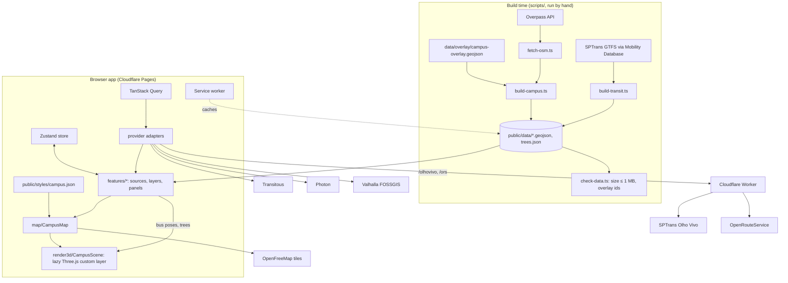

# Implementation Plan: USP Butantã Campus Map

## Context

`/home/cinatit/projects/usp-acessibility-map` is empty apart from `prompt.md`. This plan is the deliverable of that prompt: a phased, build-ready plan for a mobile-first PWA that is both an information-dense map of the USP Butantã campus and an accessibility map. No app code is written until the plan is approved; after that, each milestone (M0–M9) is one implementation session.

Research was done on 2026-10-04 (Katu-Maps reference files, live probes of every provider, an Overpass survey of the campus). Anything not confirmed is marked **to verify**.

---

## 1. Summary

A static Vite + React + TypeScript PWA on Cloudflare Pages. MapLibre renders an OpenFreeMap basemap from a local `public/styles/campus.json`. Campus buildings, POIs, accessibility features, bus stops, line shapes and trees are pre-built GeoJSON committed to the repo (OSM via Overpass + a hand-curated overlay + SPTrans GTFS). Live bus arrivals and positions come from SPTrans Olho Vivo through one small Cloudflare Worker, with Transitous scheduled times as fallback. A single lazy-loaded Three.js custom layer draws instanced trees and animated buses. UI is pt-BR only.

## 2. Decisions log

### Fixed (from the prompt)

| Area | Decision | Rationale |
|---|---|---|
| Stack | Vite + React + TS strict, Zustand, TanStack Query | Small, typed, no backend |
| Map | MapLibre GL JS via `@vis.gl/react-maplibre`, OpenFreeMap tiles | No API key |
| 3D | Three.js in one MapLibre custom layer, `InstancedMesh`, no deck.gl | Bundle size |
| Data | Build-time OSM + curated overlay + GTFS, no runtime Overpass | Offline, fast, predictable |
| Live buses | Olho Vivo via one Cloudflare Worker | Token secrecy, no CORS upstream |
| Fallbacks | Transitous (arrivals), Valhalla ↔ ORS (routing), Photon (off-campus search) | Each feature degrades alone |
| Delivery | PWA on Cloudflare Pages | Installable, offline shell |
| Tests | Vitest for parsing, adapters, pure logic only | Cheap, stable |
| Basemap | `campus.json` is the single source of truth, anchor layers, Katu style in M9 | No style code |

### From research and your answers

| Topic | Decision | Rationale |
|---|---|---|
| Bus lines | **Full treatment** (shape, live arrivals, 3D buses): 8082-10, 8083-10, 8084-10, 8085-10, 8012-10, 8022-10 (`FULL_LINES` in `scripts/build-transit.ts`). **Arrivals list only**: every other line with a stop inside the campus, found automatically from the GTFS (25 lines, including 8086-10, which turned out to be Jaguaré–Pinheiros, not a circular) | Circulars were restructured in Sept 2024; 8032-10 does not exist in any source. The final list is regenerated from GTFS, not hard-coded |
| API keys | You have both the Olho Vivo token and the ORS key | M4 and M8 are verified against the real APIs |
| GTFS source | Mobility Database feed `mdb-8` at `https://files.mobilitydatabase.org/mdb-8/latest.zip` (verified in M4, dated 2026-10-03), with `data/raw/gtfs.zip` as manual fallback | No login; same feed Transitous uses |
| Extent | Buildings, POIs, accessibility taken from everything inside the campus perimeter: the USP relation `20199272` plus the institutes it excludes (IPEN `3375375`, IPT `20199273`, CTMSP `3375374`) and the adjacent Instituto Butantan (way `74924310`); the list lives in `scripts/fetch-osm.ts`. Stops and shapes of the full-treatment lines run to Metrô Butantã | Every circular ends there |
| Lite mode | Turns off Three.js only (no trees, buses as 2D icons). Extrusions stay | Extrusions are cheap and carry the tap interaction |
| Unknown accessibility | Four states: `yes`, `partial`, `no`, `unknown` ("sem informação", gray) | Never implies "inaccessible" from missing data |
| Overlay | One GeoJSON file: features with an `osm` id patch OSM objects, features without one are new | One file to edit in geojson.io |
| Hosting | `*.pages.dev`; Worker CORS allowlist in a variable | Custom domain later is a one-line change |
| Package manager | npm, single `package.json`, Worker in `worker/` | Simplest |
| Search library | MiniSearch 7.2 (prefix + fuzzy, accent folding) | ~7 KB gz, lazy-loaded |
| Trees | Positions pre-computed at build time (275 mapped trees + deterministic scatter in 153 wood polygons) | Removes Katu's 1,470-line runtime sampler |

### Versions (latest on npm, 2026-10-04; pin exactly in M0)

`react` 19.3 · `vite` 8.3 · `typescript` 7.0 · `maplibre-gl` 6.12 · `@vis.gl/react-maplibre` 8.1.3 (peer `maplibre-gl >= 4`) · `three` 0.186 · `zustand` 5.0 · `@tanstack/react-query` 5.104 · `minisearch` 7.2 · `vite-plugin-pwa` 2.0 · `vitest` 5.0 · `wrangler` 4.147. Build scripts only: `tsx`, `osmtogeojson` (3.0.0-beta.5, the `latest` tag; flattens tags into feature properties), `fflate`, `csv-parse`, `@turf/boolean-point-in-polygon`.

### What Katu-Maps teaches

**Reuse (patterns, re-typed, not copied wholesale):**
- Custom-layer matrix setup from `TreeModelLayer.ts:950-958, 1425-1439`: local metres (x east, y up, z north), `scene.rotateX(π/2)`, `scale(1,1,-1)`, then `mainMatrix × translate(origin) × scale(s,-s,s)` from `options.defaultProjectionData.mainMatrix`; renderer shares the map canvas and GL context, `autoClear = false`, `resetState()` before each render, `frustumCulled = false`.
- Deterministic hashing `coordinateSeed` / `seededUnit` (`TreeModelLayer.ts:111-123`) for tree rotation, scale and color.
- Low-poly bus built from an extruded rounded shell plus boxes (`TransitVehicleModelLayer.ts:98-116, 221-300`), and frame-rate-independent smoothing `1 - exp(-9·dt)` (`:637`).
- Zoom thresholds: 3D model above a minimum zoom, 2D icon hidden above another (`:38-39`).
- Provider module shape from `transit/HslVehiclePositionProvider.ts`: a pure exported `normalize…()` function (unit-tested) plus a thin object implementing a capability interface.
- Rule from `TRANSIT_VEHICLE_POSITION_PLAN.md`: interpolate to the latest fix, never extrapolate past it; label live versus scheduled.
- Controls from `API_SERVICE_ASSESSMENT.md`: debounce, `AbortSignal`, timeouts, visibility-aware polling, identifying client header.

**Avoid:** one renderer per layer (Katu creates two); per-vehicle `Group` meshes with many materials; runtime vegetation sampling with generators and frame budgets; continuous `triggerRepaint()` when nothing moves; lighting constants duplicated in code; style built in TypeScript; a coordinating `MapView` god-file.

## 3. Architecture



**3D pipeline.** `render3d/CampusScene.ts` is the only `CustomLayerInterface` (`id: 'campus-3d'`, `renderingMode: '3d'`), inserted before `anchor-3d`. It owns one `WebGLRenderer`, one `Scene`, one `Camera`, and a fixed origin at the campus centre (the campus is about 3 km wide and flat, so no recentring and no terrain). Actors register with it: `TreesActor` and `BusesActor`. Each frame: actors `update(dt)` → build projection from `mainMatrix` → `resetState()` → `render()`. It calls `map.triggerRepaint()` only while an actor reports it is animating. Lighting comes from `lighting.ts`, which converts `map.getStyle().light` (position `[r, azimuth, polar]`, color, intensity) into one `DirectionalLight` and one `HemisphereLight`, and re-reads on `styledata`.

## 4. Folder structure

```
usp-acessibility-map/
├─ index.html
├─ package.json  tsconfig.json  vite.config.ts  vitest.config.ts
├─ .env.example                  # VITE_API_BASE (Worker URL), VITE_CLIENT_ID. No secrets
├─ public/
│  ├─ styles/campus.json         # basemap style, single source of truth
│  ├─ data/                      # generated, committed (≤ 1 MB total)
│  │  ├─ buildings.geojson  pois.geojson  accessibility.geojson
│  │  ├─ stops.geojson  lines.geojson  trees.json  institutes.json
│  └─ icons/                     # PWA icons, map sprite additions
├─ data/
│  ├─ overlay/campus-overlay.geojson   # hand-curated (you maintain)
│  ├─ overlay/institutes.json          # sigla, name, color
│  └─ raw/                             # gitignored: overpass.json, gtfs.zip
├─ scripts/
│  ├─ fetch-osm.ts               # Overpass → data/raw/overpass.json
│  ├─ build-campus.ts            # raw + overlay → public/data
│  ├─ build-transit.ts           # GTFS (+ Olho Vivo line codes) → stops, lines
│  ├─ check-data.ts              # size budget, unmatched overlay ids
│  └─ lib/                       # normalize.ts, mergeOverlay.ts, trees.ts, gtfs.ts (tested)
├─ worker/
│  ├─ wrangler.jsonc
│  └─ src/ index.ts  olhovivo.ts  ors.ts  cors.ts  cache.ts
└─ src/
   ├─ main.tsx  App.tsx
   ├─ strings/pt-BR.ts           # every user-facing string
   ├─ config.ts                  # campus centre, bbox, endpoints, limits, zooms
   ├─ domain/                    # types.ts, access.ts (status derivation), geo.ts
   ├─ lib/                       # http.ts (timeout, abort, ProviderError), fallback.ts
   ├─ state/                     # store.ts (selection, layers, lite mode, route)
   ├─ map/                       # CampusMap.tsx (composition only), anchors.ts,
   │                             #   useStaticGeoJSON.ts, attribution, camera helpers
   ├─ render3d/                  # CampusScene.ts, lighting.ts, TreesActor.ts,
   │                             #   BusesActor.ts, busGeometry.ts, treeGeometry.ts,
   │                             #   index.ts (lazy entry)
   ├─ features/
   │  ├─ buildings/              # layers.tsx, BuildingPanel.tsx, parse.ts
   │  ├─ accessibility/          # layers.tsx, legend, filters, parse.ts
   │  ├─ pois/                   # layers.tsx, categories.ts, PoiPanel.tsx
   │  ├─ search/                 # index.ts (MiniSearch), SearchBox.tsx, photon.ts
   │  ├─ transit/                # layers.tsx, StopPanel.tsx, providers/
   │  │                          #   (olhovivo.ts, transitous.ts), interpolate.ts,
   │  │                          #   useArrivals.ts, useVehicles.ts
   │  ├─ routing/                # RoutePanel.tsx, layers.tsx, providers/
   │  │                          #   (valhalla.ts, ors.ts), polyline.ts
   │  └─ litemode/               # detect.ts, fpsWatchdog.ts, toggle
   └─ ui/                        # BottomSheet, LayerMenu, Toast, icons
```

Rules: soft cap of ~300 lines per file; `CampusMap.tsx` only mounts `<Map>` and each feature's `<…Layers/>`; components never read raw API payloads or raw GeoJSON properties, only domain types returned by `parse.ts` / providers.

## 5. Data schemas

### Domain types (`src/domain/types.ts`)

```ts
export type LngLat = [lng: number, lat: number];
export type AccessStatus = 'yes' | 'partial' | 'no' | 'unknown';
export type DataSource = 'osm' | 'curated';

export interface AccessInfo {
  status: AccessStatus;
  entrance?: AccessStatus;       // step-free entrance
  toilet?: AccessStatus;         // accessible toilet inside
  elevator?: boolean;
  parking?: number;              // reserved spaces
  note?: string;                 // free text, pt-BR
  checked?: string;              // ISO date of last survey
  source: DataSource;
}

export interface Building {
  id: string;                    // 'way/123' | 'relation/45' | 'curated/slug'
  name?: string;
  shortName?: string;
  institute?: string;            // key into institutes.json, e.g. 'IF'
  kind: string;                  // university, dormitory, retail, roof, ...
  height: number;                // metres (tag, levels × 3.2, or default 6)
  minHeight: number;
  center: LngLat;
  access: AccessInfo;
}

export interface Institute { id: string; name: string; color?: string; }

export type PoiCategory =
  | 'food' | 'library' | 'bank' | 'atm' | 'water' | 'toilets' | 'bike_rental'
  | 'bike_parking' | 'parking' | 'health' | 'culture' | 'sport' | 'info' | 'other';

export interface Poi {
  id: string; name?: string; category: PoiCategory;
  position: LngLat; access: AccessInfo;
  buildingId?: string; openingHours?: string;
}

export type AccessFeatureKind =
  | 'ramp' | 'elevator' | 'entrance' | 'toilet' | 'parking' | 'kerb' | 'steps';

export interface AccessibilityFeature {
  id: string; kind: AccessFeatureKind; status: AccessStatus;
  position: LngLat; buildingId?: string; level?: string;
  note?: string; checked?: string; source: DataSource;
}

export interface BusStop {
  id: string;                    // GTFS stop_id (= Olho Vivo `cp`, to verify)
  name: string; position: LngLat;
  lineIds: string[];             // e.g. ['8082-10', '701U-10']
  shelter?: boolean; access: AccessStatus;
}

export interface BusLine {
  id: string;                    // '8082-10'
  name: string;                  // headsigns
  color: string;
  tier: 'full' | 'arrivals';     // full = shape + 3D buses
  directions: { olhoVivoCode: number; headsign: string; shape: LngLat[] }[];
}

export interface BusVehicle {
  id: string;                    // Olho Vivo prefix `p`
  lineId: string; direction: 0 | 1;
  position: LngLat; recordedAt: number;   // epoch ms from `ta`
  accessible: boolean;                    // Olho Vivo `a`
}

export interface Arrival {
  lineId: string; headsign: string;
  time: number;                  // epoch ms
  source: 'live' | 'scheduled';
  vehicleId?: string; accessible?: boolean;
}

export interface RouteStep { instruction: string; distance: number; hasSteps?: boolean; }
export interface Route {
  provider: 'valhalla' | 'ors';
  profile: 'walk' | 'wheelchair';
  stepFree: 'guaranteed' | 'best-effort' | 'no';
  geometry: LngLat[]; distance: number; duration: number;
  steps: RouteStep[];
}

export interface GeocodeResult {
  id: string; label: string; detail?: string;
  position: LngLat; source: 'local' | 'photon';
  ref?: { type: 'building' | 'poi' | 'stop' | 'institute'; id: string };
}
```

### Generated GeoJSON properties (short keys, whitelist only)

| File | Geometry | Properties |
|---|---|---|
| `buildings.geojson` | Polygon | `id, name?, sn?, inst?, kind, h, mh, acc, ent?, wc?, elev?, park?, note?, chk?, src` |
| `pois.geojson` | Point | `id, name?, cat, acc, bld?, oh?, src` |
| `accessibility.geojson` | Point | `id, kind, acc, bld?, lvl?, note?, chk?, src` |
| `stops.geojson` | Point | `id, name, lines` (comma string), `shelter?, acc` |
| `lines.geojson` | LineString per direction | `id, dir, code` (Olho Vivo `cl`), `head, color, tier` |
| `trees.json` | n/a | `{ origin, trees: [dx_cm, dy_cm, height_dm, seed][] }` (integers relative to the origin) |

Coordinates are rounded to 6 decimals. No geometry simplification: `buildings.geojson` is 254 KB without it (measured in M1). `acc` uses `y | p | n | u`. `promoteId: 'id'` on every source so `feature-state` (selection, hover) works.

### Curated overlay (`data/overlay/campus-overlay.geojson`)

```jsonc
{ "type": "FeatureCollection", "features": [
  // 1. Patch: has "osm", geometry may be null. Properties override OSM-derived ones.
  { "type": "Feature", "geometry": null,
    "properties": { "osm": "way/158789266", "name": "Instituto de Física – Ala Central",
      "institute": "IF", "wheelchair": "limited", "elevator": true,
      "note": "Rampa pela entrada lateral", "checked": "2026-10-10" } },
  // 2. New feature: no "osm", needs "kind" and a geometry.
  { "type": "Feature", "geometry": { "type": "Point", "coordinates": [-46.7346, -23.5609] },
    "properties": { "kind": "elevator", "wheelchair": "yes", "building_id": "way/158789266", "level": "0-3" } },
  // 3. Removal of a wrong OSM object.
  { "type": "Feature", "geometry": null, "properties": { "osm": "node/999", "delete": true } }
] }
```

As built (M3): overlay properties are OSM tags applied before normalization, so one code path handles OSM and curated data; booleans become `yes`/`no`. The key for a point's building is `building_id` (plain `building` is the OSM tag). `institute` accepts a sigla or id. The build itself (`npm run data:build`), not `check:data`, fails on unknown ids and prints the coverage report. Full reference: README, "Como editar o overlay".

Merge rules (`scripts/lib/mergeOverlay.ts`, unit-tested):
1. Normalize OSM elements to internal records keyed `type/id`.
2. For each overlay feature with `osm`: `delete` removes the record; otherwise shallow-merge properties (overlay wins, `null` deletes a key); a non-null geometry replaces the OSM geometry; set `src = 'curated'`.
3. Overlay features without `osm` become new records with id `curated/<kind>-<hash of coordinates>`.
4. Buildings without an `institute` get one by point-in-polygon against OSM `amenity=college` areas (33 exist) mapped through `institutes.json`.
5. Derive `acc` with `deriveAccessStatus()` (`wheelchair=yes|designated → y`, `limited → p`, `no → n`, else `u`).
6. `check-data.ts` fails on overlay `osm` ids not present in the raw data and prints a coverage report (percentage of buildings with a name, an institute, a known status).

## 6. Provider adapters

All in feature folders, all built on `src/lib/http.ts` (`fetchJson(url, { signal, timeoutMs })`, throws `ProviderError { provider, kind: 'network' | 'http' | 'quota' | 'parse' | 'empty' }`). Each provider file exports a pure `parse…()` function (tested with recorded fixtures) and an object implementing one interface.

```ts
interface ArrivalsProvider   { id: string; getArrivals(stop: BusStop, signal: AbortSignal): Promise<Arrival[]>; }
interface VehiclesProvider   { id: string; getVehicles(lines: BusLine[], signal: AbortSignal): Promise<BusVehicle[]>; }
interface RoutingProvider    { id: string; route(req: RouteRequest, signal: AbortSignal): Promise<Route>; }
interface GeocodingProvider  { id: string; search(query: string, signal: AbortSignal): Promise<GeocodeResult[]>; }
```

`src/lib/fallback.ts` exports `withFallback(primary, ...others)`, which tries each in order and rethrows the last error; the caller gets the provider id that answered.

| Capability | Chain | Notes |
|---|---|---|
| Arrivals | `olhovivo` → `transitous` → empty state | Olho Vivo `GET /Previsao/Parada?codigoParada=`; `t` is local `HH:MM`, resolved against `hr`. Transitous `GET https://api.transitous.org/api/v1/stoptimes?stopId=br-sao-paulo_<id>&n=20` (verified: CORS `*`, São Paulo present, schedule only). Scheduled results show the "horário programado" label. Current MOTIS API version path **to verify** |
| Vehicle positions | `olhovivo` only | No fallback exists (Transitous has no positions). On failure buses vanish and a small "sem dados ao vivo" chip appears |
| Routing, normal | `valhalla` → `ors` (`foot-walking`) | Valhalla `POST https://valhalla1.openstreetmap.de/route`, `costing: pedestrian`, `language: pt-BR`, header `X-Client-Id` (preflight acceptance **to verify**). Client-side throttle of 1 request/s |
| Routing, step-free | `ors` (`wheelchair`) → `valhalla` (`type: wheelchair`, high `step_penalty`) | ORS options: `avoid_features: ['steps']`, `restrictions: { maximum_incline: 6, maximum_sloped_kerb: 0.06 }`. Valhalla cannot exclude steps, so its result is `stepFree: 'best-effort'` and the UI says "pode conter degraus" |
| Geocoding | `local` (always) + `photon` (online only) | Photon: `?q=&lat=-23.5613&lon=-46.7308&bbox=-46.83,-23.80,-46.36,-23.35&limit=5`, debounce 350 ms, ≥ 3 characters, results outside the campus boundary only. Verified: CORS `*`, 1 h cache header |

## 7. Cloudflare Worker spec

`worker/src/index.ts`, no storage bindings. It forwards raw upstream payloads; all parsing stays in the client adapters.

| Route | Upstream | Validation | Cache |
|---|---|---|---|
| `GET /olhovivo/Previsao/Parada?codigoParada=` | same path on `https://api.olhovivo.sptrans.com.br/v2.1` | integer | 15 s |
| `GET /olhovivo/Posicao/Linha?codigoLinha=` | same | integer | 15 s |
| `GET /olhovivo/Posicao/Linhas?codigos=a,b,…` | fan-out of `/Posicao/Linha`, returns `[{ codigo, body }]` | ≤ 20 integers | per code, 15 s |
| `POST /ors/v2/directions/{wheelchair\|foot-walking}/geojson` | `https://api.openrouteservice.org` | body ≤ 2 KB, exactly 2 coordinates, both inside the São Paulo bbox | 5 min, key = SHA-256 of body |
| `GET /health` | none | n/a | none |

Anything else returns 404. The fan-out route is the one addition beyond pure forwarding: without it a phone would make 14 requests per poll (7 lines × 2 directions).

- **Olho Vivo auth:** `POST /Login/Autenticar?token=…`; the returned cookie is kept for 15 minutes under a synthetic key in the Cache API (documented reuse limit is 20 minutes), not in module-level state. On 401 it signs in once more and retries. A refused sign-in is remembered for 60 s so a bad token does not hammer the login endpoint.
- **As built (M4):** `build-transit.ts` looks up line codes by calling Olho Vivo directly from Node with the token from `worker/.dev.vars`, so the Worker exposes no `/Linha/Buscar` route. A browser `Origin` that is not in `ALLOWED_ORIGINS` gets 403. The ORS route is added in M8.
- **Caching:** `caches.default` with a synthetic GET cache key; `Cache-Control: public, max-age=15` back to the browser so repeated polls from many phones collapse into one upstream call per 15 s.
- **Rate limiting:** Workers Rate Limiting binding keyed on `CF-Connecting-IP`: 60/min for `/olhovivo/*`, 10/min for `/ors/*`. Returns 429 with `Retry-After`.
- **CORS:** `ALLOWED_ORIGINS` variable (`https://<project>.pages.dev`, `http://localhost:5173`); echo the origin only if listed; answer `OPTIONS`.
- **Errors:** JSON `{ error: 'upstream' | 'rate_limited' | 'bad_request' | 'auth', status }`, upstream timeout 8 s → 504. Never log the token, cookie, or key; log only route, status and duration.
- **Secrets:** `wrangler secret put OLHOVIVO_TOKEN` and `ORS_API_KEY`; local values in `worker/.dev.vars` (gitignored).

## 8. Performance plan

| Budget | How it is met |
|---|---|
| Initial JS | **No budget** (dropped after M0: `maplibre-gl` 6.12 alone is 279 KB gz plus a 141 KB worker, and enforcing a limit added complexity). Three.js and all 3D code stay in a lazy `render3d` chunk so lite mode never downloads them; search and routing are lazy where that is free |
| Interactive < 3 s on 4G | `campus.json` and static GeoJSON are same-origin and precached; `<link rel="preconnect">` to `tiles.openfreemap.org`; buildings and stops sources load first, others on idle; no blocking fonts |
| 30+ fps | One extrusion layer for ~560 buildings; symbol layers with `minzoom`; Three.js draws 2–3 calls total; repaint requested only while buses animate; `antialias` follows the map's context; pixel ratio capped at 2 |
| One draw call per type | Trees: trunk and crown merged into one geometry with vertex colors → one `InstancedMesh`, `MAX_TREES = 4000`, matrices written once (`StaticDrawUsage`). Buses: one merged low-poly geometry, per-line tint via `instanceColor` → one `InstancedMesh`, `MAX_BUSES = 64`. Optional blob shadows: one more call |
| LOD | Trees hidden below zoom 15. Buses are a 2D symbol layer below zoom 15.5 and 3D above. Accessibility and secondary POI icons from zoom 16 |
| Polling 15–30 s, visible only | TanStack Query `refetchInterval: 20_000`, `refetchIntervalInBackground: false`, `enabled` tied to layer visibility (vehicles) or an open stop panel (arrivals). Worker cache makes the upstream rate independent of user count |
| Static data ≤ 1 MB | Property whitelist with short keys, 6-decimal coordinates, simplification, integer-encoded trees, only 7 line shapes. `check-data.ts` enforces it |
| Lite mode | `detect.ts`: `prefers-reduced-motion`, no WebGL2, `deviceMemory ≤ 2`, or `hardwareConcurrency ≤ 4` with a coarse pointer → lite. `fpsWatchdog.ts`: if average frame time stays above 40 ms for 3 s with 3D on, switch to lite and show a toast with "desfazer". Manual choice is stored in `localStorage` and always wins. In lite mode the `render3d` chunk is never requested |

## 9. Milestones

Commands used throughout: `npm run dev -- --host` (open the LAN URL on a phone), `npm run typecheck`, `npm test`, `npm run build`, `npm run check:data`.

### M0: Scaffold, tooling, base style
- **Goal:** an empty campus map on a phone, with the style contract in place.
- **Files:** `package.json`, `tsconfig.json` (strict, `noUncheckedIndexedAccess`), `vite.config.ts`, `vitest.config.ts`, `.gitignore`, `.env.example`, `README.md`, `index.html`, `src/main.tsx`, `src/App.tsx`, `src/config.ts`, `src/strings/pt-BR.ts`, `src/state/store.ts`, `src/map/CampusMap.tsx`, `src/map/anchors.ts`, `public/styles/campus.json`, `src/map/maplibre.ts` (worker URL wiring for MapLibre 6).
- **Notes:** `git init`. Download `https://tiles.openfreemap.org/styles/liberty` into `campus.json` (sources `openmaptiles` and `ne2_shaded`, 127 layers). Edit it: remove layer `building-3d` (campus extrusions replace it), add a `light` block (liberty has none), set `center [-46.7285, -23.5610]`, `zoom 15`, and add four anchors as `{ "type": "background", "layout": { "visibility": "none" } }`: `anchor-campus-areas` (after land use and water, before roads), `anchor-features` (before the first symbol layer, `waterway_line_label`), `anchor-3d` (right after it), `anchor-labels` (last). `anchors.ts` exports the ids as constants. `maxBounds` a little wider than the campus + Metrô Butantã. Attribution control always visible, compact on mobile.
- **Acceptance:** map loads centred on campus; the four anchors exist (`map.getLayer`); attribution shows OpenFreeMap, OpenMapTiles, OSM; strict typecheck passes.
- **Verify:** `npm run typecheck && npm run build`; on the phone, pan/zoom/rotate/pitch work and attribution is readable.

### M1: OSM build script and extruded buildings
- **Goal:** campus buildings in 3D from committed data.
- **Files:** `scripts/fetch-osm.ts`, `scripts/build-campus.ts`, `scripts/check-data.ts`, `scripts/lib/normalize.ts` (+ test), `public/data/buildings.geojson`, `src/domain/types.ts`, `src/domain/access.ts` (+ test), `src/features/buildings/layers.tsx`, `src/features/buildings/parse.ts` (+ test).
- **Notes:** Overpass query over the union of the campus areas (USP + IPEN + IPT + CTMSP + Instituto Butantan) with `out geom`, covering buildings, amenities, entrances, `wheelchair`, steps, kerbs, elevators, parking, trees, wood areas; mirror fallback list and a `User-Agent`. Height: `height` tag, else `building:levels × 3.2`, else 6 m (75% of buildings have one of the first two). `building=roof` gets `mh` so it floats. Layer: `fill-extrusion` before `anchor-3d`, color by `kind`, `feature-state` for hover/selected.
- **Acceptance:** about 897 buildings render extruded; `buildings.geojson` is under 450 KB; no network call to Overpass at runtime.
- **Verify:** `npm run data:osm && npm run data:build && npm run check:data && npm test`; on the phone, pitch the map and compare a few known buildings (Biênio, CRUSP blocks).

### M2: Search and building detail panel
- **Goal:** find any building, institute or POI offline; tap a building to see its details.
- **Files:** `src/map/staticData.ts` (cached loaders used with React `use()`; the map layer itself just gives MapLibre the URL), `src/map/MapSelection.tsx`, `src/domain/geo.ts` (+ test), `src/ui/BottomSheet.tsx`, `AccessSummary.tsx`, `SelectionSheet.tsx`, `src/features/buildings/BuildingPanel.tsx`, `src/features/institutes/InstitutePanel.tsx`, `src/features/pois/PoiPanel.tsx`, `categories.ts` (+ test), `parse.ts`, `src/features/search/engine.ts` (+ test), `load.ts`, `SearchBox.tsx`, `photon.ts` (+ test), `public/data/pois.geojson`, `public/data/institutes.json`, `data/overlay/institutes.json`, `src/lib/http.ts`. `src/lib/fallback.ts` moves to M4, where it is first used.
- **As built:** institutes are derived from OSM (named `amenity=college|research_institute|hospital` objects that are not buildings); `data/overlay/institutes.json` only adds or overrides siglas by OSM id. Buildings get their institute by point-in-polygon at build time (merge rule 4, done here instead of M3). The detail sheet sits below the map on phones and beside it on wide screens instead of overlaying it, so attribution stays visible. Photon results are filtered by the campus bounding box, not the exact boundary.
- **Notes:** MiniSearch fields `name, shortName, institute name, sigla, category label`; accent folding via `normalize('NFD')`; prefix + fuzzy 0.2; boost institutes and named buildings. The index is built in a lazy chunk on first focus of the search box. Photon section "Fora do campus" appears below local results only when online and the query has ≥ 3 characters. Selecting a result flies the camera and opens the panel. Panel shows name, institute, kind, and the four-state accessibility block (mostly "sem informação" at this stage).
- **Acceptance:** "fisica" finds Instituto de Física with no network; airplane mode still searches; Photon failure hides only its section.
- **Verify:** `npm test`; on the phone, search with and without accents, with Wi-Fi off, and tap three buildings.

### M3: Accessibility layer and curated overlay
- **Goal:** accessibility as a first-class layer, fed by OSM plus your overlay.
- **Files:** `data/overlay/campus-overlay.geojson` (starts empty: no accessibility facts are invented), `scripts/lib/mergeOverlay.ts` (+ test), `scripts/lib/accessibility.ts` (+ test), update `build-campus.ts` and `normalize.ts`, `public/data/accessibility.geojson`, `src/features/accessibility/layers.tsx`, `icons.ts` (icons drawn on a canvas at runtime), `AccessControl.tsx` (toggle, legend, filter chips), `AccessFeaturePanel.tsx`, `parse.ts` (+ test), `README.md` section "Como editar o overlay".
- **As built:** ramps, elevators, kerbs and steps from OSM are always in the layer; entrances, toilets and parking only when their accessibility is recorded. Status is encoded by icon shape as well as colour (circle, rounded square, diamond, hollow circle).
- **Notes:** point kinds: ramp, elevator, entrance, toilet, parking, kerb, steps. Icons use shape and symbol as well as color (not color alone). A top-level "Acessibilidade" toggle recolors building extrusions by status (green, amber, red, gray) and shows the point layer; per-kind filter chips. The building panel lists its accessibility features and shows `note` and `checked`.
- **Acceptance:** overlay patch, addition and deletion all take effect after `npm run data:build`; an unknown `osm` id fails `check:data`; the coverage report prints.
- **Verify:** `npm run data:build && npm run check:data && npm test`; on the phone, toggle the layer and open a building you patched.

### M4: Stops, routes, Worker, live arrivals, scheduled fallback
- **Goal:** tap a stop and see live arrivals, or scheduled ones if live data is down.
- **Files:** `scripts/build-transit.ts`, `scripts/lib/gtfs.ts` (+ test), `olhovivoCodes.ts`, `campus.ts`, `public/data/stops.geojson`, `public/data/lines.geojson`, `worker/wrangler.jsonc`, `worker/src/index.ts`, `routes.ts` (+ test), `olhovivo.ts`, `src/lib/fallback.ts` (+ test), `src/features/transit/layers.tsx`, `StopPanel.tsx`, `useArrivals.ts`, `time.ts` (+ test), `parse.ts`, `providers/olhovivo.ts` (+ test), `providers/transitous.ts` (+ test, recorded fixture).
- **Wording:** scheduled times say whether Olho Vivo answered with no buses ("sem ônibus previstos agora") or could not be reached ("dados ao vivo indisponíveis").
- **Verified with the real token (2026-10-04):** GTFS `stop_id` is the Olho Vivo `cp`; GTFS direction 0 is Olho Vivo `sl` 1 (checked on 8022-10 against GTFS stop order); the destination sign is `lt0` for `sl` 1 and `lt1` for `sl` 2; all 10 line codes resolved; the parser is tested against a recorded response.
- **Notes:** `build-transit.ts` reads the GTFS zip with `fflate`, keeps trips of the configured lines, picks the most frequent shape per direction, keeps stops within the campus boundary plus all stops of full-tier lines, and resolves Olho Vivo `cl` codes through the Worker's `/Linha/Buscar`. **To verify first:** the `mdb-8` download URL; that GTFS `stop_id` equals Olho Vivo `cp`; whether 8086-10, 8012-10 and 8022-10 are all still in service. Line layers go before `anchor-features`, stop symbols before `anchor-labels`. `QueryClientProvider` is added here. Record real responses as test fixtures.
- **Acceptance:** stops and seven line shapes render; a stop panel shows arrivals refreshing every 20 s; stopping the Worker switches the list to "horário programado" within one cycle; blocking Transitous too shows a calm empty state; polling stops when the tab is hidden; no token appears in the bundle (`grep` on `dist/`).
- **Verify:** `npx wrangler dev` + `npm run dev`; `curl` each Worker route, including a non-whitelisted one (404) and a disallowed origin; `npm test`; on the phone at a real stop, compare with the official Olho Vivo app.

### M5: Three.js layer and live 3D buses
- **Goal:** buses moving smoothly along their routes in 3D.
- **Files:** `src/render3d/index.ts`, `CampusScene.ts`, `lighting.ts` (+ test), `BusesActor.ts`, `busGeometry.ts`, `src/map/Scene3D.tsx` (lazy loader), `src/features/transit/useVehicles.ts`, `interpolate.ts` (+ test), `busTracker.ts`, `LiveBuses.tsx` (flat markers and tap targets), `BusPanel.tsx`, update `providers/olhovivo.ts` (+ recorded positions fixture).
- **As built:** `busTracker` is a plain module outside React that both renderers read; the 3D layer reads it every frame. Flat markers show below zoom 15.5 and whenever the 3D layer is off; a transparent circle layer stays on at every zoom as the tap target, since MapLibre cannot hit-test Three.js models. A fix is stale when it is 3 minutes older than the newest fix in the same response (not 90 s by the device clock, which may be wrong). Lite mode is so far only `prefers-reduced-motion`; detection and the toggle come in M6. The camera is kept in the URL hash.
- **Notes:** the chunk is imported with `import('./render3d')` after the map's first `idle`. `interpolate.ts` is pure: project each fix onto the line shape (distance along), animate from the previous distance to the new one over the poll interval, take heading from the shape tangent, never pass the latest fix, drop vehicles older than 90 s, and snap instead of animating when the jump exceeds 600 m or the fix is over 60 m from the shape. Tapping a bus shows line, destination and whether it is accessible (Olho Vivo `a`).
- **Acceptance:** buses of the seven lines appear, move without teleporting, and face along the road; Three.js is absent from the entry chunk; lighting on buses matches the extrusions; one draw call for all buses (`renderer.info.render.calls`).
- **Verify:** `npm test`; in the Network panel, confirm the `render3d` chunk loads after the map; on the phone, watch a circular for a few minutes and check fps with Chrome remote debugging.

### M6: Instanced trees and lite mode
- **Goal:** trees across the campus, and a safe path for weak devices.
- **Files:** `scripts/lib/trees.ts` (+ test), `src/domain/trees.ts` (+ test, file encoding), update `build-campus.ts`, `public/data/trees.json`, `src/render3d/TreesActor.ts`, `treeGeometry.ts`, `src/features/litemode/detect.ts` (+ test), `fpsWatchdog.ts` (+ test), `LiteMode.tsx` (watchdog hook and the round "3D" button), `src/ui/Toast.tsx`.
- **As built:** 287 mapped trees and 2,842 trees along mapped tree rows (one every 9 m) are all kept; the 3,848 generated in the 17 wood polygons are thinned evenly to fill the 4,000 budget. One tree shape, varied per instance in height, width, rotation and tint, so the whole campus is a single draw call (no second crown shape, no shadows). `trees.json` is a flat integer array, 71 KB. The 3D switch is its own button for now; M7's layer menu can absorb it.
- **Notes:** build-time generation: mapped `natural=tree` nodes first, then a seeded jittered grid inside wood polygons (spacing about 12 m), skipping points inside buildings, capped at 4,000 with deterministic priority. Runtime: two crown shapes chosen by seed, per-instance color jitter, matrices written once.
- **Acceptance:** trees render in one draw call (two with shadows); lite mode removes trees and switches buses to 2D with no reload; with `prefers-reduced-motion` the `render3d` chunk is never fetched; the manual toggle persists.
- **Verify:** `npm test`; emulate reduced motion in DevTools and check the Network panel; on a mid-range Android, confirm 30+ fps while panning with 3D on.

### M7: PWA, secondary POIs, deploy
- **As built:** live at `https://usp-campus-map.pages.dev` (classic Pages) with the Worker at `usp-campus-map-api.rochinha.workers.dev`. POIs are one symbol layer with canvas-drawn icons, filtered by the categories chosen in `LayerMenu` (which also took over the 3D switch); they are hidden in the accessibility view. Differences from the notes below: basemap tiles, fonts and sprites are `CacheFirst` (tile URLs are versioned) and only the tile index is `StaleWhileRevalidate`, to spare OpenFreeMap; the `render3d` chunk and `trees.json` are left out of the precache and cached on first use, so lite mode still never downloads them; updates are prompted, not automatic; `OfflineBanner` became `ui/MapStatus.tsx`, the single status line. Not done: a Lighthouse run and the phone checks.
- **Goal:** installable, usable offline, live on Cloudflare.
- **Files:** `vite.config.ts` (`vite-plugin-pwa`), `public/icons/*`, `src/features/pois/layers.tsx`, `categories.ts`, `PoiPanel.tsx`, `src/ui/LayerMenu.tsx`, `src/ui/OfflineBanner.tsx`, `README.md` (deploy steps).
- **Notes:** precache the app shell, `campus.json`, and `public/data/*`. Runtime caching: OpenFreeMap tiles, glyphs and sprites `StaleWhileRevalidate` with an entry cap; Worker, Transitous, Photon, Valhalla `NetworkOnly`. POI categories: food, library, bank/ATM, drinking water, toilets, bike rental (22), bike parking (58), parking (139), health, culture, sport. Deploy: `npx wrangler deploy` (Worker), `npx wrangler pages deploy dist`, set `VITE_API_BASE` and `ALLOWED_ORIGINS`.
- **Acceptance:** Lighthouse reports an installable PWA; in airplane mode after one visit the map, buildings, search and accessibility layer work and transit shows the offline state; production URL works on the phone.
- **Verify:** `npm run build && npx wrangler pages dev dist`; install to the home screen; run `npm run check:data` one last time against the production build.

### M8: On-campus routing
- **As built:** chains as planned (walk: Valhalla → ORS; step-free: ORS → Valhalla best-effort). The Worker route is `GET /ors/route?profile=&from=&to=` rather than a forwarded POST: the Worker builds the ORS body itself, so a client can choose only the profile and two points inside Greater São Paulo, and the answer is cacheable by URL (5 min, 10 requests/min per client). Valhalla's preflight accepts `X-Client-Id` (verified). Valhalla maneuver type 40 marks stairs; its English "Take the stairs." is replaced in the adapter. Route state is `routePlan` in the store; a map tap or search result fills the end being picked. Both adapters are tested against responses recorded on 2026-10-04 for the two ends of one staircase; ORS `waytype` 8 marks stairs (verified).
- **Goal:** walking routes from A to B, with a step-free option.
- **Files:** `src/features/routing/RoutePanel.tsx`, `layers.tsx`, `polyline.ts` (+ test), `providers/valhalla.ts` (+ test), `providers/ors.ts` (+ test), `worker/src/ors.ts`, update `store.ts` and search (pick endpoints from the map, local search, Photon, or "minha localização").
- **Notes:** chains as in section 6. Route line before `anchor-features` with a casing; segments with steps drawn dashed. Step-by-step list in pt-BR. Show which provider answered and the `stepFree` level. Requests fire only on explicit action (no routing on every drag), throttled to 1/s.
- **Acceptance:** a normal and a "sem degraus" route between two buildings differ where steps exist; forcing each provider to fail still yields a route from the other; ORS quota error (429) falls back and shows a notice.
- **Verify:** `npm test`; block each host in DevTools in turn; on the phone, walk a short route and compare.

### M9: Katu-style basemap
- **As built:** `scripts/export-katu-style.ts` (kept, documented as one-off) bundles `GlobalMapStyle.ts` with esbuild, stubbing `import.meta.env` and `navigator`, runs it, prunes 129 layers to 87 plus the four anchors, and writes `campus.json`. Beyond the planned removals it drops layers hidden in Katu-Maps, layers only visible below zoom 13, and Katu's bus-stop dots; Katu's hidden flat-footprint layer is switched on so buildings outside the campus still show. The style needs no sprite. No file under `src/` changed.
- **Goal:** replace liberty with a pruned export of Katu's `GLOBAL_MAP_STYLE`, with no app code change.
- **Files:** `scripts/export-katu-style.ts` (one-off), `public/styles/campus.json`, `README.md` (credit).
- **Notes:** needs `/home/cinatit/projects/Katu-Maps` added back as a working directory. Run with `tsx`, stubbing `import.meta.env` and `navigator`, import `GLOBAL_MAP_STYLE` and `JSON.stringify` it; never open the file. Then prune (mercator projection, drop terrain, globe biomes, aeroway, tunnel portals, bridge fallback sources, hiking), set label text to `["coalesce", ["get", "name:pt"], ["get", "name"]]`, drop its building extrusion layer, keep `light`, re-insert the four anchors at the same logical positions.
- **Acceptance:** the app runs with zero changes under `src/`; anchors present; attribution intact; Katu-Maps (MIT) credited in the README.
- **Verify:** `git diff --stat` shows only the style, script and README; `npx @maplibre/maplibre-gl-style-spec` validation passes; visual check on the phone at zoom 14–19.

### M10: Follow a bus and see its stops
- **Goal:** from a stop's arrivals, tap a bus to follow it on the map and see every stop of its line as a checklist ("passou", "em 3 min") down to the stop the user started from.
- **As built:** `useBusProgress` (bus pose, its line's stops placed along the route, how many are passed, the user's stop) feeds both the panel and the map layers. The timeline opens at the bus: stops behind it are folded behind "Mostrar N pontos anteriores", except the last one. The selected bus gets a ring in `LiveBuses.tsx`. `project()` in `interpolate.ts` was split so `locateStops` can reuse the per-segment projections.
- **Flow:** stop panel → tap a live arrival → bus panel with "← Todas as chegadas", line badge and destination, a status line ("Posição ao vivo · seguindo" or "· acompanhamento pausado"), the "Seguir veículo" button and the stop timeline. The camera follows the bus until the user drags the map; the button resumes it. Closing the panel or going back stops following.
- **Step 1, data** (`scripts/build-transit.ts`, `parse.ts`, `domain/types.ts`): each direction in `lines.geojson` gets `stops`, the ordered stop ids of the same trip the shape comes from (about 4 KB in total; every one of these stops is already in `stops.geojson`). `LineDirection` gets `stopIds`. The build fails if a listed stop is missing from `stops.geojson` and reports stops more than 40 m from the shape.
- **Step 2, pure logic** (`src/features/transit/lineStops.ts` + test): `locateStops(shape, positions)` gives each stop its distance along the route, projecting in order so the distance never goes backwards (needed for the 8085-10 circular, which passes the same street twice); `passedCount`, `targetIndex` and `estimateTimes` derive what the timeline shows. `busTracker` poses additionally expose `direction`, `along` (metres along the route) and `onRoute`.
- **Step 3, times per stop** (`lineStops.ts`, `BusPanel.tsx`): no new request. The time at the user's stop is the live prediction the stop panel already polls (same query); the stops between the bus and that stop get an estimate that shares this time out by distance, shown with "≈" and a note saying so. Opened by tapping a bus on the map, the timeline has no times.
- **Step 4, state** (`state/store.ts`, `SelectionSheet.tsx`): the bus selection becomes `{ kind: 'bus'; id; fromStop?: string }`; `followBus: boolean` is set when a bus is opened from an arrival and cleared when the selection changes; `flyTo(position)` moves the camera and pauses following.
- **Step 5, panel** (`StopPanel.tsx`, `BusPanel.tsx`, new `StopTimeline.tsx`, `ui/BottomSheet.tsx`, strings, CSS): an arrival row becomes a button when it is live, names a vehicle and that vehicle is in the tracker; other rows stay plain text. `BottomSheet` gets an optional `back` action. The timeline is an ordered list with a vertical rail: filled dot and "Passou" for stops behind the bus, an "Ônibus aqui" marker, hollow dot and "≈ N min" for stops ahead, and the user's stop highlighted as "Seu ponto". Tapping a stop in the list flies to it.
- **Step 6, map** (new `FollowCamera.tsx` and `FollowedLine.tsx` in `features/transit`, `CampusMap.tsx`): `FollowCamera` eases the centre to the bus every 500 ms, keeping zoom, bearing and pitch (jumps instead when reduced motion is on), and pauses on a `dragstart` caused by the user. `FollowedLine` draws the followed direction with its stops as checkpoints (passed filled, ahead hollow, the user's stop larger) and a ring around the bus; it works the same in lite mode.
- **Step 7, line shapes hidden by default** (`features/transit/layers.tsx`): the coloured line shapes are no longer drawn all the time. The `bus-lines` layers get a filter and show only the direction of the selected bus; with no bus selected, no line shape is on the map. Stops and live buses stay as before, and buses keep their line colour.
- **Decisions:**
  - The list ends at the user's stop when the bus was opened from a stop; opened by tapping a bus on the map, it shows the whole line with no highlighted stop.
  - No line shape is drawn until the user selects a bus. There is no way to select a line by itself and no "show all lines" switch.
  - Only the six tracked lines can be followed. The other lines calling at campus stops (701U-10 and the like) have no shape or positions in the app; adding one means adding it to `FULL_LINES`.
  - Scheduled arrivals (Transitous) cannot be followed: there is no vehicle behind them.
- **Verified with the real token (2026-10-04):** `/Previsao/Linha` answers `{"hr": …, "ps": []}` for every campus line code even while `/Previsao/Parada` has predictions for the same buses, so it is not used and the Worker is unchanged. A bus predicted at a stop was reported on the same direction code as the prediction (82662 on 8022-10, 82624 on 8012-10). If a bus is on another direction than the stop, the panel shows that direction's whole line without a highlighted stop.
- **Acceptance:** on load the map shows stops and buses but no coloured line shapes; selecting a bus (from an arrival or on the map) draws only its direction, and closing the panel removes it; tapping a live arrival of a tracked line opens the bus panel and the camera follows the bus; dragging the map pauses it and the button resumes it; stops behind the bus say "Passou" and the list ends at the stop the user came from; "Todas as chegadas" returns to the stop panel; a bus that leaves the feed shows "Este ônibus não está mais no mapa." and stops following; offline, the panel says so; nothing changes for lines that are not tracked.
- **Verify:** `npm test` (stop projection on an out-and-back shape, passed count, target stop on a loop, time estimates); `npm run check:data`; headless Chrome against the dev server with the local Worker on a weekday; on the phone, follow a circular for a few stops and compare with the Olho Vivo app.

### M11: Wikipedia description, photos and address in the building panel
- **Goal:** selecting a building shows its address, a photo carousel, a short description from the Portuguese Wikipedia and a "Ler na Wikipédia" link, with the credits the licences require. Wikipedia text and photos are fetched live when the panel opens; the address is static.
- **As built:** Nominatim's `lookup` only knows 229 of the 898 buildings (it does not index unnamed ones), so `fetch-osm.ts` now also downloads the named streets and a building without a Nominatim answer gets the nearest one within 150 m: 793 of 898 buildings (88%) have an address. The pointer is one `wiki` property (article title, or a Wikidata id resolved when the panel opens): 12 buildings, 24 institutes, 22 places. One hook, `useWikiArticle`, fetches summary and photos together. No custom request header is sent, which avoids a CORS preflight on every call. The carousel gives an image its `src` only when it is the current or the next one, because browsers load `loading="lazy"` images in a horizontal strip straight away. Photos are 16:10. Checked in headless Chrome: FAU building (4 photos), a sibling building (no new request), Biblioteca Brasiliana (own article and website), a building with no article (address only), and offline on a production build after one visit.
- **Which article (checked in `data/raw/overpass.json`, 2026-10-04):** 56 campus objects carry `wikipedia` or `wikidata` tags, but only 12 are buildings. About 30 are institute areas (FAU, IME, Poli, ...), and 645 of the 898 buildings sit inside an institute. So a building shows its own article when it has one, otherwise the article of its institute, labelled as such ("Sobre a FAU"). Buildings with neither show the address only.
- **Live sources, called from the browser (no key, CORS `*`, verified 2026-10-04):**
  - **Summary:** `pt.wikipedia.org/api/rest_v1/page/summary/{title}`: extract, canonical title, page URL, lead image.
  - **Photos:** `pt.wikipedia.org/w/api.php?action=query&generator=images&prop=imageinfo&iiprop=url|mime|size|extmetadata&iiurlwidth=640&origin=*`: every image of the article with a 640 px thumbnail, author and licence, in one request. For FAU it returns 9 files, of which 4 are photos and 5 are icons, flags and logos.
  - **Wikidata** `wbgetentities` (`sitelinks`, `ptwiki`, `origin=*`): only when an object has a `wikidata` tag and no `wikipedia` tag (12 objects).
- **Static, fetched at build time:**
  - **Addresses from Nominatim.** Only 61 of 898 buildings have `addr:street` in OSM, so the build asks Nominatim, which works out the nearest street. `lookup` takes 50 OSM ids per request: 18 requests, one per second, with a descriptive `User-Agent`, cached in `data/raw/addresses.json` and refreshed only with `--refresh`. No phone ever calls Nominatim. About 35 KB added to the static data.
  - **Pointers and contact tags from the Overpass file:** `wikipedia`, `wikidata`, `website`/`contact:website` (28 buildings) for buildings, institutes and POIs, about 5 KB.
- **Caching of the live calls (configuration only):**
  - TanStack Query: `staleTime` and `gcTime` 24 h per article title, so reopening a panel, or opening ten FAU buildings in a row, makes no new request; identical requests in flight are shared.
  - Service worker (`vite.config.ts`): `StaleWhileRevalidate` for the Wikipedia and Wikidata API URLs, `CacheFirst` (30 days, 80 entries) for photos on `upload.wikimedia.org` and `thumb.wikimedia.org`. Places already seen work offline.
- **Step 1, static data** (new `scripts/fetch-addresses.ts`, `npm run data:addresses`, `scripts/lib/address.ts` + test, `scripts/build-campus.ts`, `scripts/lib/normalize.ts` + test, `src/features/*/parse.ts`, `src/domain/types.ts`): `Building` gets `address?: string` ("Rua do Lago, 876 · 05508-080", built from road, house number and postcode) and, with `Institute` and `Poi`, `wikipedia?`, `wikidata?`, `website?`. A missing `addresses.json` is not an error: the build warns and writes no addresses.
- **Step 2, adapters** (new `src/features/wiki/providers/wikipedia.ts` + tests against recorded responses, `types.ts`): pure parsers plus thin fetchers on `fetchJson`, returning `WikiSummary { title, extract, url }` and `WikiPhoto[] { src, width, height, author?, license?, page }`. Extract trimmed at a sentence end near 400 characters; HTML stripped from the author field; disambiguation pages rejected. Photo filter: JPEG or PNG only, at least 400 px wide, not SVG (drops flags, logos and maintenance icons), the summary's lead image first, at most 8.
- **Step 3, hooks** (`useWikiSummary.ts`, `useWikiPhotos.ts`): each a `useQuery` with the cache settings above and `retry: false`. The article is the building's own tag, else its institute's.
- **Step 4, carousel** (new `src/ui/Carousel.tsx`, CSS): a horizontal scroll-snap strip, so swiping works natively on phones with no gesture code; previous and next buttons for mouse and keyboard; a "1/8" counter; images after the first are `loading="lazy"`; fixed 4:3 frame with `object-fit: cover` so the sheet does not jump; a photo that fails to load is removed; with one photo the buttons and counter are hidden; `prefers-reduced-motion` turns smooth scrolling off. Under each photo, its credit: "foto: author · licence · Commons", linking to the file page.
- **Step 5, panel** (new `src/features/wiki/WikiSection.tsx`, `BuildingPanel.tsx`, `InstitutePanel.tsx`, `PoiPanel.tsx`, strings): address under the title; then the carousel, the extract clamped to five lines, "Ler na Wikipédia · Wikipédia, CC BY-SA", and the website link when there is one. While loading, a placeholder of the same height; on failure, or offline with nothing cached, the section is absent: the rest of the panel never waits for it.
- **Step 6, docs** (`README.md`): credits for Wikipedia, Wikimedia Commons and Nominatim; `npm run data:addresses`.
- **Not in this milestone:** the Save and Share buttons of the reference screenshot; photos from the object's Commons category (often more and better photos than the article has; a later addition to the same hook).
- **Risks:** an article with no usable photo shows text only; an OSM tag may point to a renamed article (both endpoints follow redirects); Commons author fields are free-form HTML (strip tags, fall back to "Wikimedia Commons"); Wikidata items without a Portuguese article (Reitoria) show no description; several photos per panel cost mobile data (640 px thumbnails, lazy loading, only the first is fetched until the user swipes).
- **Acceptance:** a building inside FAU shows its address and the FAU photos, text and link under "Sobre a FAU", and the carousel swipes and steps through 4 photos with a credit on each; Biblioteca Brasiliana shows its own article and website; a building with no article shows the address only; opening the same or a sibling building again makes no network request; with Wikipedia blocked the panel still shows the address and everything it shows today; no request is made until a building is selected.
- **Verify:** `npm test` (address formatting, both parsers, photo filter, extract trimming, article choice); `npm run data:addresses && npm run data:build && npm run check:data`; headless Chrome on a FAU building, Biblioteca Brasiliana and an untagged building, stepping the carousel, counting requests on a second open, then offline after a first visit.

### M12: Trees in the green areas, fewer along the streets
- **Goal:** the tree layer reads as wooded parks and gardens, not as lines of trees along every street.
- **As built (2026-10-04):** of 4,000 trees, 254 mapped (42 in street lines thinned), 643 in rows (136 of 143 rows line a street; 2,842 before), 681 in the named grounds (IB 45, IP 82, IPEN 447, Inova USP and AUCANI 107), 1,092 in 35 parks, gardens and grass areas (Parque Esporte para Todos 107, Praça do Relógio 459) and 1,330 in woods. Differences from the plan below:
  - The area around IB was empty because its two woods are OSM relations, and the old query only fetched ways. The query now fetches them, and `priorityWoods` in the overlay keeps them dense (898 of their 1,854 grid points) while the other woods, mostly the Instituto Butantan forest, are thinned to 11%.
  - Budget order: mapped trees, named grounds and lawns are kept whole and only the woods are thinned, through a weight in `selectTrees`.
  - Inova USP and AUCANI have no area in OSM, so the overlay plants a 130 m circle around the Inova USP building; IPEN, which is very large, uses a wider spacing (16 m).
  - The helpers are in `scripts/lib/treePlacement.ts` (+ test). The extra regions of step 5 were not added: the Praça do Relógio, the Reitoria lawns and the other squares are already covered by the parks and grass rule.
  - Afterwards the total was lowered at the user's request, in steps, to 1,000. At that size nothing fits whole, so every tree is thinned through `selectTrees` weights (mapped trees 34, rows, lawns and named grounds 15, priority woods 4, other woods 1). Final build: 148 mapped, 157 in rows, 200 in named grounds, 291 in parks and grass, 204 in woods (142 around IB). The counts above are from the 4,000 build.
  - Checked with before and after screenshots of the campus overview, IB, the park, IPEN, IP and Inova USP, with 3D on. Nothing under `src/` changed.
- **Today (`npm run data:build`, 2026-10-04):** trees come from three OSM sources: 287 individually mapped trees, 143 `tree_row` lines turned into a tree every 9 m (2,842 trees), and 16 woods filled on a 12 m jittered grid (3,848 trees). Mapped trees and rows are kept whole and the woods are thinned to the 871 that still fit the 4,000-instance budget, so the rows are 71% of all trees and the open lawns stay empty: nothing fills grass, parks, gardens or institute grounds.
- **Decision: still build-time and deterministic.** Trees stay in `public/data/trees.json`, generated by `build-campus.ts` from OSM polygons with the same position-hashed jitter, so the map looks the same on every load. No change under `src/`, and the 4,000 budget and the 3D layer stay as they are.
- **Step 1, more OSM input** (`scripts/fetch-osm.ts`): add to the Overpass query the green polygons (`landuse` grass, meadow, recreation_ground; `natural` scrub, grassland; `leisure` park and garden are already fetched), the roads (`highway` primary to service: 692 ways, checked 2026-10-04) and the things trees must not stand on (`amenity=parking`, `leisure=pitch|track|swimming_pool|stadium`, `natural=water`, `landuse=basin`). Checked on Overpass: the campus has 50 grass areas, 13 parks, 35 gardens and 14 woods, including Parque Esporte para Todos (about 6 ha), Praça do Relógio and the Fitotério do IB. All of this stays in `data/raw/`; none of it is shipped.
- **Step 2, fewer street trees** (`scripts/lib/trees.ts` + test, `build-campus.ts`): a pure `distanceToLines(point, roads)` helper. A `tree_row` whose line runs within 15 m of a road is a street row: keep one tree in five, picked by the position hash so the survivors are irregular rather than evenly spaced. An individually mapped tree counts as part of a street line when it is within 12 m of a road and has two or more mapped neighbours within 25 m that are also near that road: the same one-in-five thinning. Rows and mapped trees away from roads (courtyards, squares) are kept.
- **Step 3, fill the green areas** (`build-campus.ts`, new `data/overlay/tree-areas.json`): three kinds of fill area, all scattered with the existing `scatterInPolygon`:
  - OSM woods, as today (dense, tall).
  - OSM parks, gardens and grass areas larger than 1,500 m² (sparser and with gaps, so lawns still read as lawns).
  - Institute grounds, for the regions you named that OSM has no green polygon for. `tree-areas.json` lists institutes by sigla or id and optional hand-drawn polygons with a density each: IB, IP (Psicologia), IPEN, Inova USP and AUCANI, plus Parque Esporte para Todos if its OSM polygon turns out to be incomplete. The fill area is the institute's own area from OSM.
  - In every fill area a tree is rejected when it is inside a building or within 4 m of one, within 7 m of a road centreline (4 m for service roads and paths), or on a parking lot, pitch, track, pool or water. Tree density varies by a low-frequency hash so the fill has clumps and clearings instead of an even grid.
- **Step 4, budget** (`scripts/lib/trees.ts` `selectTrees` + test): priority when over 4,000: kept mapped trees, then institute grounds and parks, then woods, each thinned evenly by hash. The build report prints trees per source and per named area, before and after thinning, so the result can be tuned from numbers. `check:data` keeps `trees.json` near its current 71 KB (same count, same encoding).
- **Step 5, other regions I would add** (to confirm in the screenshots before listing them in `tree-areas.json`): the slope between the Raia Olímpica and Av. Prof. Mello Moraes, the grounds of the Instituto Butantan side of the campus, the lawns around the Reitoria and the CRUSP blocks, and the green belt along Av. Escola Politécnica.
- **Not in this milestone:** tree species or seasonal colours; trees outside the campus boundary.
- **Risks:** institute areas include yards and internal streets that OSM does not map as roads or parking, so some trees may land on paved ground (mitigation: lower density for institute fills, hand-drawn exclusion polygons in `tree-areas.json`, visual check per region); OSM grass polygons include sports lawns and the Praça do Relógio's open centre (mitigation: the size threshold, per-area density override); a street with real, dense tree cover will look barer than it is.
- **Acceptance:** each region you named (around IB, Parque Esporte para Todos, around IPEN, around the Instituto de Psicologia, around Inova USP and AUCANI) shows scattered trees in the 3D view; no tree stands on a building, road, parking lot, pitch or water; streets no longer show continuous lines of trees; the tree count stays at or under 4,000; two consecutive builds produce an identical `trees.json`; nothing under `src/` changes.
- **Verify:** `npm test` (distance to roads, street-line detection, thinning ratio, blockers, deterministic output); `npm run data:osm && npm run data:build && npm run check:data`; headless Chrome screenshots at zoom 16 of each named region, before and after, with 3D on.

### M13: Bus stop icons and a larger ring on the selected symbol
- **Goal:** bus stops look like Katu-Maps' (white disc, blue bus pictogram, name underneath), and a tapped stop, POI or accessibility symbol grows into a larger disc with a ring.
- **As built (2026-10-04):**
  - Stops are a symbol layer (`src/features/transit/layers.tsx`, icon in `stopIcon.ts`) instead of white dots, shown from zoom 14 and named from zoom 17. A stop never gives way to another symbol. The pictogram was drawn for this project from a screenshot; no Katu-Maps file was opened.
  - `src/map/badgeIcon.ts` draws every badge twice: the normal one and `…-selected`, a 42 px white disc with a 3 px ring in the badge's colour and the normal badge in its centre. The ring is always round, so the accessibility shapes keep their meaning.
  - `icon-size` cannot use feature-state, so each feature has a second layer (`bus-stops-selected`, `pois-selected`, `accessibility-selected`) filtered to the selected id, and the base layer filters that id out. The change is instant, not animated.
  - The selected POI is drawn even when its category is switched off or the accessibility view is on, so a POI opened from search is always marked.
  - The pin is now only for selections without a symbol: an institute, an off-campus place, and an accessibility point while the accessibility view is off.
  - Checked in headless Chrome at desktop and phone width: stop, POI and accessibility point selected, tapped again and deselected.

### M14: Roof shapes on landmark buildings
- **Goal:** landmark buildings get a shaped roof instead of a flat top.
- **Finding (2026-10-04):** OSM has no roof data for the campus: `roof:shape` on 4 of 898 buildings, all `flat`, and no roof colour, height or direction. So roofs come from a curated overlay, and OSM roof tags are read too, for when they exist.
- **As built (2026-10-04):**
  - `data/overlay/roofs.json` by building id (shape, height, ridge `direction`, `rise`, colour). `scripts/lib/roofs.ts` (+ test) builds the triangles at build time: gabled, skillion, round and sawtooth as a height profile across the ridge, on any footprint including L-shapes and courtyards (the footprint is triangulated with `earcut`, a new dev dependency, and each triangle is cut into the profile's bands); pyramidal and dome as rings shrinking to the middle. Hipped is drawn gabled.
  - `public/data/roofs.json` (11 roofs): per roof an anchor, eave height, colour, the building's accessibility code and triangles in decimetres. `buildings.geojson` gains `eh` (eave height) on those buildings.
  - `src/render3d/RoofsActor.ts`: one merged mesh with vertex colours, one draw call. It reads the selection and the accessibility view from the store, so a roof turns the selection colour or the status colour together with its walls.
  - The building layer extrudes to `eh` only while the roofs are actually drawn (`roofsActive` in the store); in lite mode, or if `roofs.json` fails to load, buildings keep their full flat-topped height.
  - `roofs.json` is not precached; like `trees.json` it is cached on first use.
  - First overlay: 4 greenhouses at IB (gabled), the covered courts and a sports hall at CEPEUSP (round), a storage tank (dome), the Tanque de Provas Numérico (gabled). All guessed from building type and name, to be corrected by someone who knows the buildings. The Observatório do Campus is a box with a dome on top (the user's description), so the overlay has a `diameter` field: a round dome of that size standing in the middle of the flat top, instead of a roof over the whole footprint.
  - FAU (Edifício Vilanova Artigas) has a `coffered` roof, from a model the user sent: a 2.5 m rim and a grid of low pyramids standing on the flat top. The real roof has about 12 × 20 skylights; at the user's request the grid is coarser, 6 × 10 cells of 11 m (`cell` in the overlay), a quarter of the triangles. The towers and pillars of the model are not drawn.
  - The "Cirquinho" (Poli, `relation/6275389`) has a shallow cone with a lantern, from an aerial photo the user sent: `pyramidal` on the round footprint, 2.5 m high, plus the new `lantern` field (the cone stops at 9 m across and a six-sided turret stands there). The eight dormers and the ribbing of the metal sheets are not drawn.
  - Monuments: the unnamed artwork in Praça Ramos de Azevedo (`node/11805525378`) is named "Monumento a Ramos de Azevedo" through the overlay, with its Wikipedia article, and is drawn in 3D from stacked blocks (`data/overlay/landmarks.json`, `scripts/lib/landmarks.ts` + test): stepped base, four columns, a block and the bronze group as a leaning pyramid, about 23 m tall, facing north-east down Av. Prof. Almeida Prado (told by the user). Its triangles are extra entries in `roofs.json`, drawn by `RoofsActor`.
  - From an aerial image the user sent: the three sheds behind the IPT building are gabled (the two grey ones with two bays side by side, new `bays` field; the third single and pale green), and Engenharia Civil has a `coffered` roof without a rim (new `rim: false`), drawn with 26.4 m cells, twice the real 13.2 m module, at the user's request to cut triangles (72 instead of 288). The coffered grid now also works on a stepped outline: each cell is kept when it lies inside it.
  - Colour: the sheds and Engenharia Civil first used the dark greys and the green of the photo, which the user found too dark for the map style; the two grey sheds and Engenharia Civil now use the FAU roof colour, `#cfcdc6`; the third shed keeps its pale green.
  - Checked in headless Chrome: every roof with 3D on, a selected roofed building, the accessibility view and lite mode.

## 10. Later phases

| Item | What the MVP already provides |
|---|---|
| Transit trip planning to/from campus | Transitous adapter and Photon endpoint picking exist; add a `plan` capability and a results panel |
| Dark basemap (`campus-dark.json`) | Anchors and runtime `light` reading make a style swap code-free; colors for app layers live in one theme module |
| WCAG 2.2 AA and a non-map list view | Domain models are independent of the map, so a list/detail view can reuse them; strings are centralized |
| Bandejão menus, events, opening hours | New feature folder with its own adapter; `Poi.openingHours` already exists |
| English UI | Replace `strings/pt-BR.ts` with a keyed lookup |
| Custom domain | Change `ALLOWED_ORIGINS`, or route the Worker under `/api` |
| Indoor maps (floor plans inside a building) | Planned separately in `INDOOR_PLAN.md`, starting with FAU's Edifício Vilanova Artigas |

## 11. Risks and mitigations

| Risk | Mitigation |
|---|---|
| Very new majors (TypeScript 7, Vite 8, Vitest 5) may clash with plugins | Pin exact versions in M0; if `vite-plugin-pwa` or `tsx` misbehaves, fall back one major and note it in the README |
| Sparse OSM accessibility data (3 of 558 buildings tagged, 1 elevator) | Explicit "sem informação" state, overlay workflow, coverage report in `check:data` |
| Olho Vivo downtime, or unpublished limits and terms | 15 s Worker cache caps upstream load regardless of users; Transitous fallback; ask SPTrans about terms before public launch |
| GTFS `stop_id` ≠ Olho Vivo `cp`, or `mdb-8` stale | Verified first in M4; fallback is a build-time mapping via `/Parada/BuscarParadasPorLinha` and a manual GTFS zip |
| Line set changes again (as in 2024) | Line list lives in one config array; `build-transit.ts` regenerates everything |
| Transitous is schedule-only and volunteer-run | Used only as fallback, clearly labelled; third state is a plain empty list |
| Photon / Valhalla fair use | Debounce, explicit-action routing, 1 request/s throttle, `X-Client-Id`; notify the Valhalla operators before launch as they request |
| ORS quota (2,000/day, 40/min) | Worker cache and per-IP limit; Valhalla wheelchair fallback marked "best-effort" |
| Low-end WebGL performance | Lite mode detection plus fps watchdog; hard instance caps; zoom-gated layers |
| OpenFreeMap outage | Tiles cached by the service worker; campus data is local, so buildings, search and accessibility still work on a blank basemap |
| Overpass mirrors rate-limit or return bad characters (seen during research) | Mirror list, retries, lenient JSON parse, raw file cached in `data/raw/` |

## Verification of the whole plan

Each milestone ends with `npm run typecheck && npm test && npm run build && npm run check:data` plus the phone checks listed above. The MVP is done when M0–M7 pass on a mid-range Android over 4G against the deployed `*.pages.dev` URL.
